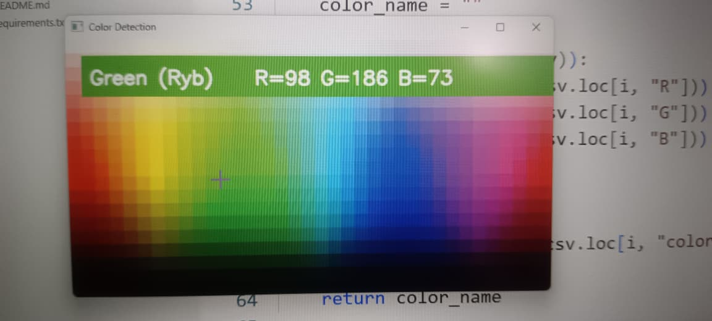
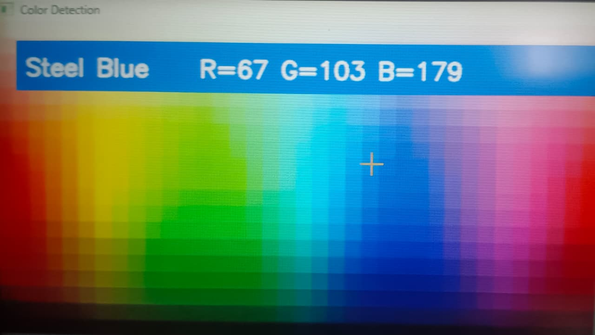

# 🎨 Color Detection Using OpenCV

## 📌 Project Description
This project detects the color name of any pixel in an image using OpenCV and a CSV color dataset.
## 🚀 Features
- Detects color names
- Displays RGB values
- Real-time mouse interaction
- Uses OpenCV and Pandas
## 🛠 Technologies
- Python
- OpenCV
- Pandas
- NumPy
## ▶️ How to Run
Install dependencies
```bash
pip install -r requirements.txt
```
Run
```bash
python color_detection.py
```
## 📸 Output
Move the mouse over the image to display the color name and RGB values.
## 📸 Project Output
<p align="center">
  
</p>
<p align="center">
  
</p>
## 🎥 Demo
Move your mouse over the image to instantly identify the nearest color along with its RGB values.
## 🚀 Future Enhancements
- Upload custom images
- Display HEX color codes
- Detect multiple colors simultaneously
- Save detected color history
- Develop a GUI using Tkinter
